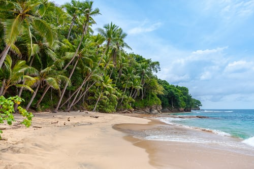
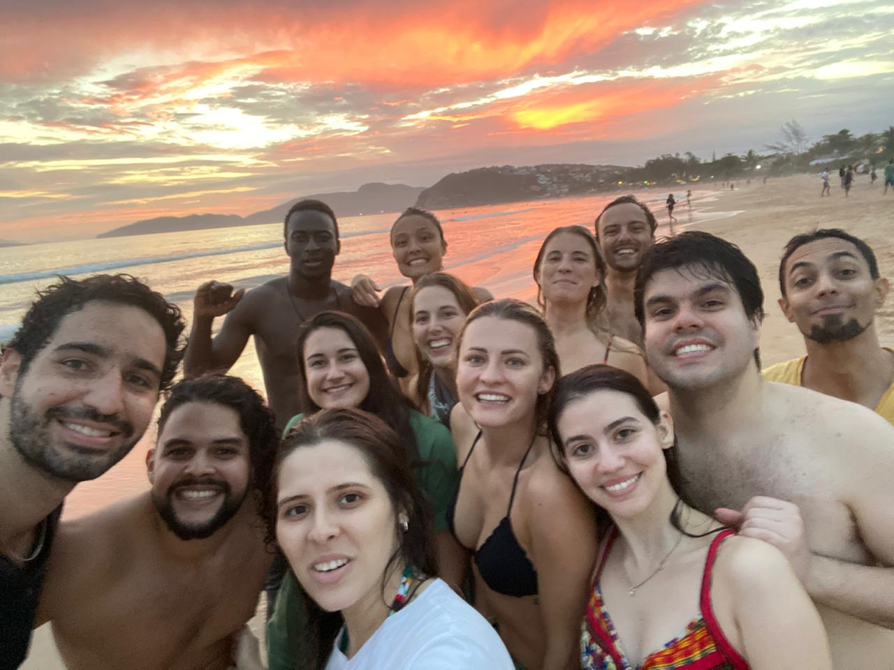

What makes a great beach all depends on the traveler. Some prefer wide stretches of sand with ample activities and throngs of people to watch, while others desire deserted shorelines with calm waters.

 &nbsp;

 &nbsp;

Some of my **favorite** beaches are:

* Agadir Beach (Morocco)
* JBR Open Beach (Dubai)
* Copacabana (Rio de Janeiro)
* Ipanema (Rio de Janeiro)
* João Fernandes (Buzios)
