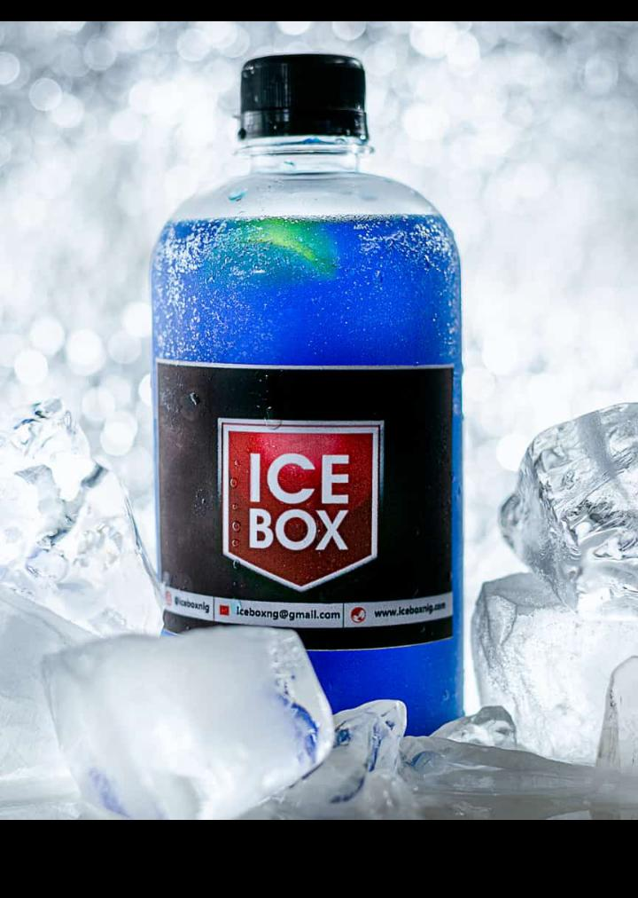

A cocktail is an alcoholic mixed drink. Most commonly, cocktails are either a combination of spirits, or one or more spirits mixed with other ingredients such as fruit juice, flavored syrup, or cream. Cocktails vary widely across regions of the world, and many websites publish both original recipes and their own interpretations of older and more famous cocktails.

 &nbsp;

 &nbsp;

